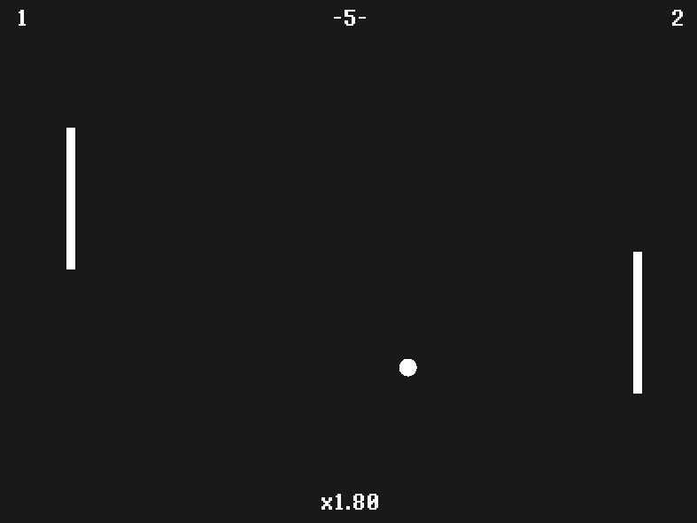

# Pong in Rust

A tiny Pong clone I wrote to learn Rust.  
It uses [`piston_window`](https://crates.io/crates/piston_window) for rendering/input.

---

## Features

- Classic Pong rules with a twist: the ball speeds up a little after every paddle bounce.
- Simple AI paddles (BOTs) that track the ball only when it’s close and moving toward them.
- Optional human control for either paddle.
- Scoreboard, round counter, and a “bounce multiplier” display.
- Clean, self-contained code with a tiny vector math helper (`Vec2f`) and simple collision system.

---

## Controls

> By default **both paddles are BOTs**. Change `CONTROL_LEFT` / `CONTROL_RIGHT` to `ControlType::PLAYER` to play yourself.

| Key       | Action                                  |
|-----------|-----------------------------------------|
| ↑ / ↓     | Move your paddle up/down (if PLAYER)    |
| Space     | Start a new round / serve the ball      |
| Esc       | Quit                                    |